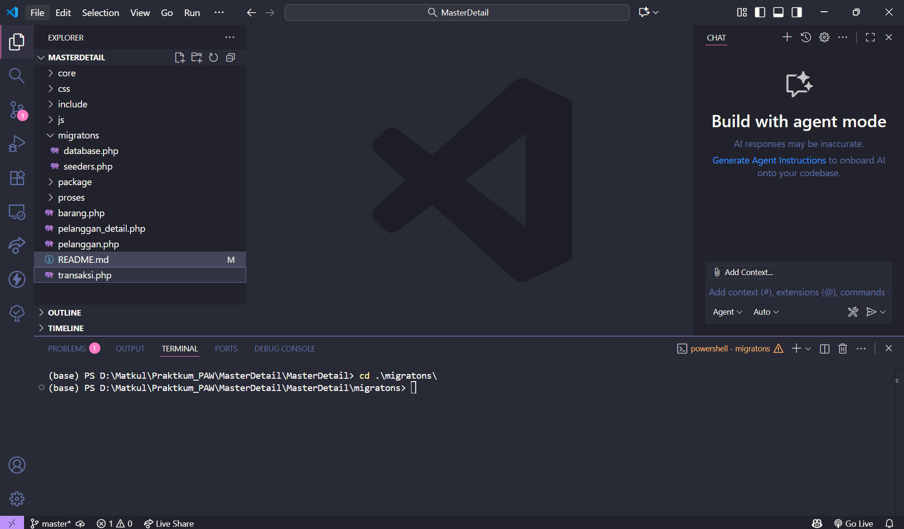
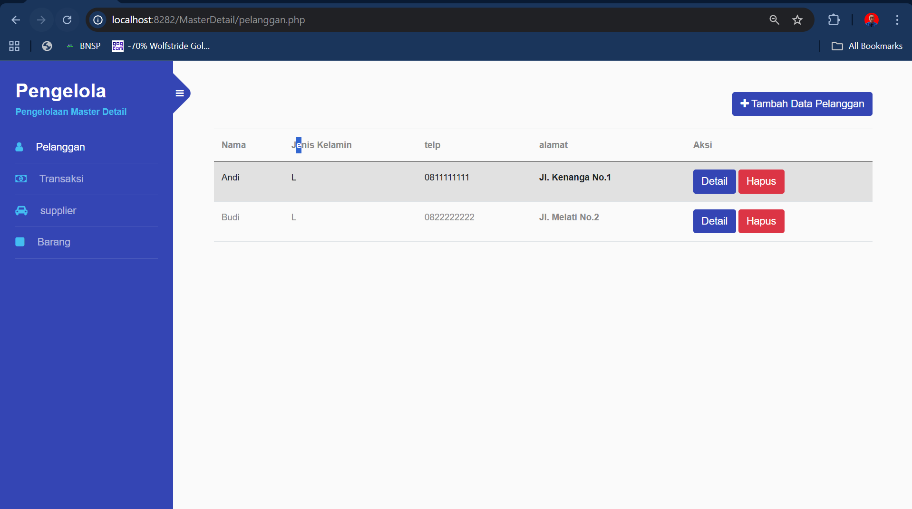

# Praktikum PAW Modul 6 Master Detail

## Persiapan Sebelum Praktikum

1. Clone repository praktikum ini ke folder webserver kalian dengan perintah:
``git clone https://github.com/zanra2401/Praktikum-PAW-Modul-6-Master-Detail MasterDetail`` 
pastikan anda clone di folder htdoc kalian jika menggunakan XAMPP jika menggunakan Laragon sesuaikan folder webserver kalian

2. setelah di clone buka folder **MasterDetail** di vscode lalu klik ``Ctrl + j`` untuk membuka terminal lalu pindah ke folder migrations dengan ``cd ./migrations`` sampai tampilan seperti ini 
 
   - lalu jalankan ``php ./database.php`` sampai muncul output:  
**Database berhasil dibuat**
   - lalu jalankan ``php ./seeders.php`` samapi muncul output:
**Seeder berhasil dijalankan!** 
> jika gagal menjalankan salah satu buka file   **/migrations/database.php** dan **/migrations/seeders.php** dan pastikan servername, username, password sesuai dengan database kalian

3. Setelah selasai semua janlankan webserver kalian (XAMPP/Laragon) dan buka ``http://localhost:80/MasterDetail/pelanggan.php``
dan pastikan tampilannya seperti berikut:

Setelah itu silakan dipelajari kode kode nya:
folder core berisi koneksi
folder include berisi file.php yang berfungsi sebagai tampilan
folder proses berisi file.php yang berfungsi sebgai proses di belakang / backend nya